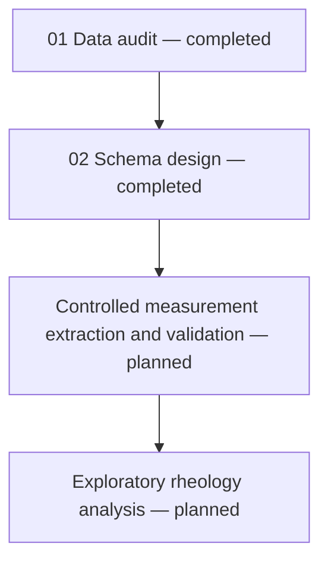

## View the rendered audit report

[Open the rendered HTML data-audit report](https://tehsongxuan.github.io/collagen-hydrogel-rheology-data-curation/01_data_audit_report.html)
# Collagen Hydrogel Rheology Data Curation and Analysis

[](https://doi.org/10.5281/zenodo.17413651)

> A reproducible Python workflow for source-data provenance, Excel-workbook
> auditing, rheology schema design, quality-control documentation and the
> preparation of bovine-collagen hydrogel rheology data for controlled
> standardisation and analysis.

## Project overview

Rheological measurements are often exported as instrument-generated
spreadsheets rather than analysis-ready scientific datasets. Before such
measurements can be compared or analysed reliably, differences in workbook
structure, variable names, unit labels, formulas, missing values and unusual
observations need to be identified and handled transparently.

This project develops an auditable workflow for curating a collection of
bovine-collagen hydrogel rheology workbooks while preserving the original
experimental records and their provenance.

The workflow separates four related tasks:

1. auditing the source workbooks and documenting quality-control findings;
2. designing explicit experiment- and measurement-level schemas;
3. performing controlled extraction and standardisation of the measurement
   records; and
4. conducting exploratory rheological analysis only after the processed data
   have passed validation.

The first two stages are complete.



## Project status

| Stage | Main artifact | Status | Purpose |
|---|---|---|---|
| Source-data audit | `01_data_audit.ipynb` | **Completed** | Verify provenance, inventory the source workbooks, identify structural and unit-label differences, investigate unusual observations and document processing decisions |
| Schema design | `02_schema_design.ipynb` | **Completed** | Define experiment and measurement record structures, identifiers, field definitions, units, missing-value policies and provenance relationships |
| Controlled extraction and standardisation | Standardised measurement tables | **Planned** | Apply the documented schema and quality-control rules to source measurement rows while retaining traceability |
| Measurement-level validation and QC linkage | Validation and QC outputs | **Planned** | Enforce schema rules and connect applicable audit findings to processed observations |
| Exploratory rheology analysis | Downstream analysis notebook | **Planned** | Examine rheological behaviour, repeatability, concentration-dependent patterns and quality-control flags after validation |

The current repository therefore documents the completed **source-data audit**
and **schema-design** stages.

Measurement extraction has not yet been performed. Measurement-level
quality-control relationships and the proposed measurement validation rules
will be implemented during subsequent processing.

---

## Scientific context

The rheology workbooks accompany the research article:

*Quantitative atlas of collagen hydrogels reveals mesenchymal cancer cell
traction adaptation to the matrix nanoarchitecture.*

The study combined rheology, focused ion beam scanning electron microscopy and
traction force microscopy to investigate how collagen concentration and
hydrogel physicochemistry relate to matrix structure, mechanics and
cancer-cell interactions.

The present repository has a narrower purpose. It focuses specifically on
developing a reproducible data-curation workflow for the accompanying rheology
workbooks.

It does not reproduce the microscopy or cell-traction analyses and does not
claim ownership of the experimental data.

---

## Data source

The source data were obtained from the following public Zenodo record:

- **Dataset:** *PID2020-113790RB-I00 data set: hydrogel viscoelastic properties from rheology tests*
- **Repository:** Zenodo
- **DOI:** [10.5281/zenodo.17413651](https://doi.org/10.5281/zenodo.17413651)
- **Related publication:** [10.1016/j.actbio.2024.07.002](https://doi.org/10.1016/j.actbio.2024.07.002)
- **Source archive:** `Reología.rar`
- **Material system:** bovine-collagen hydrogels
- **Reported collagen concentrations:** 0.8, 1.5 and 2.3 mg/mL
- **Reported measurement temperature:** 37 °C
- **Test types:** frequency sweep and time sweep

The downloaded archive is checked against the MD5 checksum published with the
Zenodo record. A SHA-256 checksum is also recorded as an additional local
integrity reference.

The raw archive and extracted Excel workbooks are treated as immutable source
records.

At the time this repository documentation was prepared, the Zenodo record did
not display a specific dataset licence in its `Rights` section. Public
accessibility alone does not establish permission to redistribute source
measurements.

The repository therefore links to the authoritative Zenodo record rather than
redistributing the raw archive, extracted workbooks or row-level processed
copies.

---

## Source-data summary

The completed audit covers **20 Excel workbooks containing 660 measurement
rows**.

| Test type | Workbooks | Measurement rows per workbook | Total measurement rows |
|---|---:|---:|---:|
| Frequency sweep | 10 | 21 | 210 |
| Time sweep | 10 | 45 | 450 |
| **Total** | **20** | — | **660** |

Filename components were parsed during the audit to recover collagen
concentration, replicate label and the original Spanish test-type designation:

- `frecuencia` → `frequency_sweep`
- `tiempo` → `time_sweep`

Each audited workbook contains one worksheet named `Hoja1`.

---

# Completed Stage 01 — Source-data audit

## `01_data_audit.ipynb`

The first notebook performs a read-only quality-control audit before any
scientific standardisation or exploratory analysis.

### Audit coverage

The workflow:

- records the dataset DOI, source URL, retrieval metadata and file checksums;
- inventories the extracted Excel workbooks;
- parses concentration, replicate and test-type metadata from filenames;
- records worksheet names, visibility, dimensions and populated ranges;
- identifies recurring heading and unit patterns for each test type;
- compares source workbooks against working expected structures;
- investigates unexpected columns and unusual numerical observations directly
  against the original workbooks;
- examines inconsistent unit labels at character level;
- validates explicit unit-label mappings; and
- exports machine-readable provenance and quality-control records.

The structures used during this audit were **working expected source schemas**
derived from repeated workbook patterns and available source metadata.

They were used to understand the source files. The later schema-design stage
defines the intended structure of processed records.

### Audit outcome

| Audit measure | Result |
|---|---:|
| Workbooks audited | 20 |
| Workbooks matching the working header structure | 19 of 20 |
| Workbooks matching the working unit structure | 15 of 20 |
| Workbooks requiring detailed inspection | 5 |
| Confirmed quality-control findings | 8 |

### Confirmed findings and processing decisions

| Finding | Evidence | Processing decision |
|---|---|---|
| Unexpected column | `Colageno_bov_0.8_2_frecuencia.xlsx`, `Hoja1`, column `F`; `F6:F15` are empty and `F16:F26` contain formulas following `=D[row]+1` | Preserve the source workbook, but exclude undocumented column `F` from the future standardised frequency-sweep dataset |
| Zero storage modulus | `Colageno_bov_0.8_1_frecuencia.xlsx`, `Hoja1`, cell `C6`; \(G' = 0\) Pa at 0.628 rad/s, with \(G'' = 1.590\) Pa at 37 °C | Retain the numeric zero, attach a quality-control flag during processing and treat derived \(\tan\delta\) as undefined where division by zero would occur |
| Six occurrences of non-standard unit labels | Temperature source labels contain `ｰC` instead of `°C`; complex-viscosity source labels contain `Paｷs` instead of `Pa·s` | Preserve the observed source labels for provenance and apply validated canonical labels only during controlled processing |

### Validated unit-label mappings

| Variable | Observed source label | Standardised label |
|---|---|---|
| Temperature | `[ｰC]` | `[°C]` |
| Complex viscosity | `[Paｷs]` | `[Pa·s]` |

The original source labels are preserved exactly as observed. Standardised
labels are applied only during controlled processing and do not alter the
original workbooks.

### Audit outputs

The completed notebook creates:

```text
metadata/source_manifest.csv
metadata/extracted_file_inventory.csv
metadata/workbook_structure_inventory.csv
metadata/workbook_schema_qc.csv
data/quality_control/unit_label_mapping_audit.csv
data/quality_control/data_quality_issue_log.csv
```

Together, these files preserve the connection between processing decisions and
their original workbook, worksheet, cell or cell range.

---

# Completed Stage 02 — Rheology schema design

## `02_schema_design.ipynb`

The second notebook converts the findings from the workbook audit into an
explicit data model for subsequent processing.

The aim is not simply to rename spreadsheet columns. The schema distinguishes
different levels of scientific information and defines how processed records
will remain traceable to their source.

The design separates:

| Record level | Intended meaning |
|---|---|
| Physical sample | One physical hydrogel replicate, where sample identity can be supported by evidence |
| Experiment | One rheological test represented by a source workbook and worksheet |
| Measurement | One source-reported measurement point within an experiment |
| Quality-control finding | One documented issue or observation associated with a source location |

This separation prevents individual measurement points from being treated as
independent hydrogel samples.

---

## Sample-linkage review

The source inventory contains matching concentration and replicate labels across
frequency- and time-sweep filenames.

The schema-design notebook reviewed these relationships before defining
experiment and sample identifiers.

### Observed filename relationships

The 20 source workbooks form **10 concentration–replicate label groups**.

| Collagen concentration (mg/mL) | Label groups | Frequency-sweep workbooks | Time-sweep workbooks |
|---|---:|---:|---:|
| 0.8 | 4 | 4 | 4 |
| 1.5 | 3 | 3 | 3 |
| 2.3 | 3 | 3 | 3 |
| **Total** | **10** | **10** | **10** |

Each label group contains one frequency-sweep workbook and one time-sweep
workbook with matching concentration and replicate labels.

### Evidence boundary

Matching filename labels establish a useful source relationship, but they do
**not** independently demonstrate that the two tests were performed on the same
physical hydrogel specimen.

For this reason:

- frequency- and time-sweep workbooks remain separate experiment records;
- no shared physical sample identifier is assigned solely from matching
  filenames;
- the original replicate labels are retained for provenance;
- paired cross-test analyses will not be assumed to be valid without additional
  experimental evidence; and
- physical sample linkage remains explicitly unresolved.

This preserves uncertainty rather than converting a filename convention into an
unsupported experimental conclusion.

---

## Experiment register

A structured experiment register was created to identify each rheological test
and connect it to its source workbook and worksheet.

The completed register contains:

- **20 experiment records**;
- **20 unique experiment identifiers**;
- **10 frequency-sweep experiments**;
- **10 time-sweep experiments**; and
- no duplicate experiment identifiers.

Each `experiment_id` is constructed as:

```text
dataset_id::original_filename::sheet_name
```

This makes experiment records directly traceable to their original dataset,
workbook and worksheet.

The identifier is deterministic while those source identifiers remain
unchanged.

### Experiment-register fields

The exported experiment register contains seven documented fields:

```text
experiment_id
dataset_id
original_filename
sheet_name
collagen_concentration_mg_ml
replicate_id
test_type_standard
```

The source replicate identifier is represented as **text**, because it is an
experimental label rather than a numerical measurement.

---

## Experiment data dictionary

An explicit data dictionary defines the experiment-register fields.

For each field, the dictionary records:

- field name;
- proposed data type;
- requirement status;
- unit, where applicable; and
- scientific or provenance definition.

All seven fields documented in the experiment data dictionary are present in
the exported experiment register.

The completed file is:

```text
metadata/experiment_data_dictionary.csv
```

---

## Measurement identity and row-level provenance

The measurement schema is designed so that each future processed observation
can be traced to:

1. the experiment from which it originated; and
2. the original Excel row containing the observation.

A proposed `measurement_id` therefore combines the experiment identifier and
source Excel row:

```text
experiment_id::row_<source_excel_row>
```

Two different coordinates are deliberately preserved:

- `source_excel_row` — the physical row number in the Excel worksheet;
- `measurement_point` — the source-reported `Meas. Pts.` value.

These are not interchangeable.

The Excel row contains workbook-layout information, while
`measurement_point` represents the observation sequence reported by the source.

---

## Important time-sweep constraint

The time-sweep workbooks contain `Meas. Pts.` but do **not** provide an
explicit elapsed-time variable or confirmed time interval.

Therefore:

- `measurement_point` is retained as measurement order;
- it is not converted to seconds or minutes;
- elapsed time is not inferred;
- time-dependent rates will not be calculated from an assumed interval; and
- any future time-axis interpretation will require supporting instrument or
  experimental metadata.

This distinction prevents unsupported temporal information from being created
during processing.

---

## Measurement data dictionary

The completed schema-design stage defines **11 proposed measurement fields**.

### Identity and provenance fields

```text
measurement_id
experiment_id
source_excel_row
measurement_point
```

### Rheological fields expected in both test types

```text
angular_frequency_rad_s
storage_modulus_pa
loss_modulus_pa
temperature_c
```

### Additional fields expected in time-sweep records

```text
shear_stress_pa
strain_percent
complex_viscosity_pa_s
```

The measurement data dictionary defines for each field:

- proposed data type;
- standardised unit;
- expected test-type applicability;
- missing-value policy; and
- scientific or provenance definition.

The completed file is:

```text
metadata/measurement_data_dictionary.csv
```

### Structural absence versus unexpected missingness

The schema distinguishes between fields that are genuinely absent because of
the test structure and values that are unexpectedly missing.

For example:

- shear stress, strain and complex viscosity are structurally absent from the
  audited frequency-sweep workbooks;
- these fields are expected for time-sweep measurements; and
- expected source values that are missing during extraction will be flagged for
  review rather than silently filled with zero.

---

## Schema relationships

The completed design establishes the following relationships:

| Relationship | Linking information | Current implementation status |
|---|---|---|
| Experiment → source worksheet | `dataset_id`, `original_filename`, `sheet_name` | **Implemented** in the exported experiment register |
| Measurement → experiment | `experiment_id` | **Defined**; measurement records not yet constructed |
| Measurement → original Excel row | `experiment_id`, `source_excel_row` | **Defined** for row-level provenance |
| Quality-control finding → source location | Workbook, worksheet and affected cell/range | **Retained** in the audit issue log |
| Quality-control finding → processed measurement | Source location and future measurement identifiers | **Planned** |
| Experiment → confirmed physical hydrogel | Evidence-supported sample identifier | **Deferred** because cross-test physical identity remains unconfirmed |

---

## Stage 02 exported outputs

The completed schema-design notebook exports:

```text
metadata/experiment_register.csv
metadata/experiment_data_dictionary.csv
metadata/measurement_data_dictionary.csv
```

### Output summary

| File | Contents |
|---|---|
| `metadata/experiment_register.csv` | 20 experiment records with source identifiers and standardised experiment metadata |
| `metadata/experiment_data_dictionary.csv` | Definitions of the seven experiment-register fields |
| `metadata/measurement_data_dictionary.csv` | Definitions of the 11 proposed measurement fields, including units, test-type applicability and missing-value policies |

These are **schema and metadata artifacts**. They are not extracted copies of
the experimental measurement tables.

---

## Current design status

The draft experiment register and the experiment and measurement data
dictionaries were constructed and exported. Structural checks were implemented
for the experiment register.

Physical sample linkage remains unresolved. Measurement extraction,
measurement-level quality-control linkage and enforcement of the proposed
measurement rules are reserved for subsequent processing.

---

# Data-handling principles

The project follows the following rules to protect the scientific record:

1. Original Excel workbooks remain unchanged.
2. No numerical measurement is silently corrected, imputed or deleted.
3. Source filenames, worksheet names and row locations are preserved for
   provenance.
4. Source labels and documented standardised representations are kept
   distinguishable.
5. Metadata corrections are applied only through explicit, documented rules.
6. Uncertain observations are retained with quality-control flags where
   appropriate.
7. Structural absence is distinguished from unexpected missingness.
8. Undocumented source fields are excluded only through documented processing
   decisions.
9. Derived quantities are calculated only where their mathematical and
   scientific basis is supported.
10. Measurement points within one experiment are not treated as independent
    physical hydrogel samples.
11. Matching filename labels are not treated as proof of shared physical sample
    identity.
12. Every future processed measurement must remain traceable to its source
    experiment and Excel row.

---

# Planned next stage — Controlled measurement extraction and validation

The next stage will apply the completed schema definitions to the source
workbooks.

Measurement extraction has **not yet been performed**.

The planned processing workflow will:

- construct one processed record per source measurement point;
- generate the defined measurement identifiers;
- retain experiment identifiers and original Excel row numbers;
- apply validated unit-label mappings;
- preserve source-reported numerical measurements;
- distinguish structural absence from unexpected missing values;
- exclude the undocumented formula column using the documented audit decision;
- retain and flag the zero-storage-modulus observation;
- connect applicable source QC findings to processed observations;
- enforce the documented data-type and missing-value rules;
- validate source-to-output row traceability;
- check expected record counts; and
- produce validation summaries before exploratory analysis.

No row-level measurement dataset will be described as analysis-ready until
these checks have been completed.

---

# Planned exploratory rheology analysis

Exploratory analysis will begin only after the extracted measurement records
pass schema and provenance validation.

## Frequency-sweep analysis

Planned analyses include:

- completeness and numerical-range checks;
- visualisation of \(G'\) and \(G''\) against angular frequency;
- comparison across collagen concentrations and source replicates;
- examination of whether \(G'\) or \(G''\) dominates across the measured
  frequency range;
- cautious identification of possible modulus-crossover regions;
- calculation of \(\tan\delta = G''/G'\) only where mathematically defined; and
- assessment of recorded temperature consistency.

## Time-sweep analysis

Planned analyses include:

- storage modulus, loss modulus and complex viscosity against measurement
  point;
- examination of shear stress, strain, angular frequency and recorded
  temperature;
- comparison of source-replicate behaviour within each concentration; and
- identification of drift, discontinuities or observations requiring further
  review.

Because elapsed time is not available in the source workbooks, time-sweep
figures will use **measurement point** rather than an inferred time axis unless
authoritative timing information becomes available.

Quality-control flags will remain visible during analysis. Flagged
observations will not be automatically discarded merely because they appear
unusual.

---

# Repository structure

The project is organised to keep original source data separate from
project-generated code, metadata and quality-control artifacts.

```text
.
├── README.md
├── environment.yml
├── 01_data_audit.ipynb
├── 02_schema_design.ipynb
├── .gitignore
├── data/
│   ├── raw/                              # Local only; excluded from GitHub
│   ├── interim/                          # Local only; extracted workbooks
│   ├── processed/                        # Future row-level processed data
│   └── quality_control/
│       ├── unit_label_mapping_audit.csv
│       └── data_quality_issue_log.csv
└── metadata/
    ├── source_manifest.csv
    ├── extracted_file_inventory.csv
    ├── workbook_structure_inventory.csv
    ├── workbook_schema_qc.csv
    ├── experiment_register.csv
    ├── experiment_data_dictionary.csv
    └── measurement_data_dictionary.csv
```

Downstream processing and exploratory-analysis artifacts will be added only as
those stages are completed and validated.

---

# Reproducibility

The project uses a dedicated Conda environment defined in
`environment.yml`.

```bash
conda env create -f environment.yml
conda activate hydrogel-rheology
jupyter notebook
```

Download the source archive from the cited Zenodo record and place it locally
at:

```text
data/raw/Reología.rar
```

Run the completed notebooks in order:

```text
01_data_audit.ipynb
02_schema_design.ipynb
```

The audit notebook establishes the source inventory and quality-control
records used by the schema-design notebook.

The schema-design notebook then uses those audit outputs to construct the
experiment register and the experiment and measurement data dictionaries.

Downstream extraction and analysis should be performed only after these
completed stages have run successfully.

---

# GitHub publication policy

The public repository is intended to demonstrate the workflow without
becoming an alternative distribution channel for the original source dataset.

| File or folder | Include publicly? | Reason |
|---|---:|---|
| `README.md` | **Yes** | Original project documentation |
| `environment.yml` | **Yes** | Reproducible software environment |
| `01_data_audit.ipynb` | **Yes, after output review** | Original audit code and interpretation; substantial row-level source-data previews should not be exposed |
| `02_schema_design.ipynb` | **Yes, after output review** | Original schema-design code and interpretation |
| `metadata/source_manifest.csv` | **Yes** | Project-generated provenance and checksum metadata |
| `metadata/extracted_file_inventory.csv` | **Yes** | Project-generated workbook inventory |
| `metadata/workbook_structure_inventory.csv` | **Yes** | Project-generated workbook-structure metadata |
| `metadata/workbook_schema_qc.csv` | **Yes** | Project-generated schema-comparison results |
| `metadata/experiment_register.csv` | **Yes, after review** | Project-generated experiment-level provenance metadata without measurement tables |
| `metadata/experiment_data_dictionary.csv` | **Yes** | Project-generated schema documentation |
| `metadata/measurement_data_dictionary.csv` | **Yes** | Project-generated schema documentation |
| `data/quality_control/unit_label_mapping_audit.csv` | **Yes** | Project-generated mapping and validation record |
| `data/quality_control/data_quality_issue_log.csv` | **Yes, after review** | Project-generated audit trail containing limited source evidence required to justify processing decisions |
| `data/raw/` | **No** | Contains the original Zenodo archive |
| `data/interim/` | **No** | Contains extracted source workbooks |
| Row-level files in `data/processed/` | **Not until reuse rights are confirmed** | Format transformation does not by itself establish redistribution rights for the underlying measurements |
| Saved publisher HTML or article PDF | **No** | Cite and link to the publication rather than redistributing downloaded publisher content |
| Publisher figures or screenshots | **No, unless permitted by the applicable licence** | Avoid unnecessary republication of third-party material |

Public notebook versions should retain:

- original project code;
- aggregate counts;
- schema summaries;
- quality-control conclusions;
- validation results; and
- scientific interpretation developed for this project.

They should avoid displaying complete or near-complete copies of source
measurement tables.

Users can obtain the authoritative source dataset directly from Zenodo and run
the workflow locally.

---

# Preparing notebooks for public release

Before publishing a notebook to GitHub:

1. inspect all cell outputs for substantial source-data reproduction;
2. retain aggregate summaries and information necessary to understand the
   workflow;
3. remove unnecessary row-level previews of the source measurements;
4. confirm that no local `C:\Users\...` paths, email addresses or other personal
   information remain;
5. restart the kernel;
6. run the notebook from beginning to end;
7. confirm that all cells execute without errors;
8. inspect all exported files; and
9. save the final publication-ready notebook under its intended repository
   filename.

For the completed stages, the intended notebook names are:

```text
01_data_audit.ipynb
02_schema_design.ipynb
```

---

# Suggested Git commit structure

Meaningful commits help make the development history understandable.

Examples include:

```text
docs: update project overview and workflow status
audit: add reproducible rheology workbook audit
metadata: add source provenance and schema-QC records
schema: add experiment register and rheology data dictionaries
docs: document sample-linkage uncertainty and processing boundaries
```

---

# Current limitations

The current project has several important limitations:

- The source dataset contains 20 workbooks and should not be considered
  representative of all collagen-hydrogel formulations or rheological
  protocols.
- Matching concentration and replicate labels across frequency- and time-sweep
  filenames do not confirm that the same physical hydrogel specimens were used.
- Physical sample linkage across test types therefore remains unresolved.
- The time-sweep workbooks do not provide an explicit elapsed-time variable or
  confirmed measurement interval.
- The cause of the isolated zero-storage-modulus observation cannot be
  determined from the workbook alone.
- The undocumented formula column has no verified scientific interpretation.
- The measurement schema has been defined but has not yet been applied to
  construct the standardised measurement tables.
- Measurement-level links to quality-control findings remain to be implemented.
- The proposed measurement validation rules remain to be enforced against the
  extracted records.
- Scientific interpretation remains preliminary until controlled extraction,
  validation and exploratory analysis have been completed.

---

# Capabilities demonstrated

The work completed so far demonstrates practical materials-data curation and
scientific workflow-engineering capabilities, including:

- scientific data provenance and checksum verification;
- systematic Excel-workbook inspection;
- source-file inventory construction;
- schema discovery and structural validation;
- character-level diagnosis of inconsistent unit labels;
- explicit unit-mapping validation;
- quality-control issue documentation;
- preservation of immutable source records;
- separation of experimental, measurement and QC record levels;
- experiment-register construction;
- deterministic experiment identifier design;
- row-level provenance design;
- scientific data-dictionary construction;
- definition of data types, units and missing-value policies;
- distinction between structural absence and unexpected missingness;
- recognition of experimental-unit and repeated-measurement structure;
- explicit handling of unresolved sample identity;
- avoidance of unsupported elapsed-time inference;
- reproducible Python/Jupyter workflows; and
- clear separation of observed evidence, curation decisions and scientific
  uncertainty.

---

# Author

Developed by [Teh Song Xuan](https://github.com/tehsongxuan) as an independent
materials-data curation and rheology workflow project.

---

# Data citation

Users of the source data should cite the original Zenodo record and associated
publication.

This repository documents an independent data-curation and analysis workflow.
It does not claim ownership of the underlying experimental measurements.

## Source dataset

Ruiz-Mateos Brea, R., Blázquez-Carmona, P., Barrasa Fano, J., Shapeti, A.,
Martín Alfonso, J. E., Dominguez, J., Reina-Romo, E., & Sanz Herrera, J. A.

*PID2020-113790RB-I00 data set: hydrogel viscoelastic properties from rheology
tests* (Version v1). Zenodo.

https://doi.org/10.5281/zenodo.17413651

## Related publication

Blázquez-Carmona, P., et al. (2024).

*Quantitative atlas of collagen hydrogels reveals mesenchymal cancer cell
traction adaptation to the matrix nanoarchitecture.*

**Acta Biomaterialia, 185**, 281–295.

https://doi.org/10.1016/j.actbio.2024.07.002
