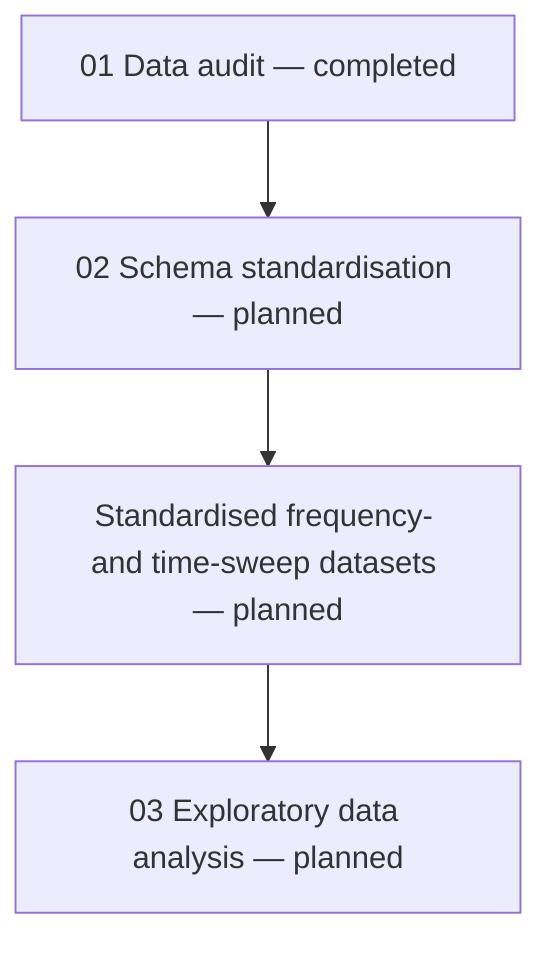

# Collagen Hydrogel Rheology Data Curation and Analysis

[](https://doi.org/10.5281/zenodo.17413651)

> A reproducible Python workflow for source-data provenance, Excel-workbook
> auditing, schema standardisation, controlled data extraction and exploratory
> analysis of bovine-collagen hydrogel rheology measurements.

## Project overview

Rheology data are commonly exported as instrument-generated Excel workbooks.
Before these measurements can be compared or analysed reliably, differences in
workbook structure, variable names, unit labels, formulas, missing values and
unusual observations must be identified and handled transparently.

This project develops an auditable workflow that converts a collection of raw
rheology workbooks into standardised, analysis-ready datasets while preserving
the original experimental records and their provenance.

The project is being developed in four connected stages:



## Project status

| Stage | Main artifact | Status | Purpose |
|---|---|---|---|
| Source-data audit | `01_data_audit.ipynb` | **Completed** | Verify provenance, inventory the workbooks, identify structural and unit-label differences, inspect unusual values and document processing decisions |
| Canonical schema definition | `02_schema_standardisation.ipynb` | **Planned** | Define standard variable names, units, data types, required fields, provenance fields and validation rules |
| Controlled extraction and standardisation | Processed frequency- and time-sweep tables | **Planned** | Apply the approved schema and quality-control rules without altering the original workbooks |
| Exploratory data analysis | `03_exploratory_data_analysis.ipynb` | **Planned** | Examine rheological behaviour, repeatability, concentration-dependent patterns and quality-control flags |

Only the data-audit stage is currently complete. Results described as planned
work are included as a transparent development roadmap, not as completed
analyses.

## Scientific context

The rheology workbooks accompany the research article *Quantitative atlas of
collagen hydrogels reveals mesenchymal cancer cell traction adaptation to the
matrix nanoarchitecture*.

The study combined rheology, focused ion beam scanning electron microscopy and
traction force microscopy to examine how collagen concentration and hydrogel
physicochemistry influence matrix structure, mechanics and cancer-cell
interactions. The present repository has a narrower scope: it develops a
reproducible curation and analysis workflow for the accompanying rheology
workbooks. It does not reproduce the microscopy or cell-traction analyses and
does not claim ownership of the experimental data.

## Data source

The source data were obtained from the following public Zenodo record:

- **Dataset:** *PID2020-113790RB-I00 data set: hydrogel viscoelastic properties from rheology tests*
- **Repository:** Zenodo
- **DOI:** [10.5281/zenodo.17413651](https://doi.org/10.5281/zenodo.17413651)
- **Related publication:** [10.1016/j.actbio.2024.07.002](https://doi.org/10.1016/j.actbio.2024.07.002)
- **Source archive:** `Reología.rar`
- **Material system:** bovine-collagen hydrogels
- **Reported collagen concentrations:** 0.8, 1.5 and 2.3 mg/mL
- **Reported measurement temperature:** 37 °C
- **Test types:** frequency sweep and time sweep

The downloaded archive is verified against the MD5 checksum published on the
Zenodo record before extraction or analysis. A SHA-256 checksum is also recorded
to provide an additional local integrity reference.

The raw archive and extracted Excel workbooks are treated as immutable source
records. At the time this README was prepared, the Zenodo record did not display
a specific dataset licence in its `Rights` section. Public accessibility alone
does not establish permission to redistribute the files. The repository will
therefore link to the authoritative Zenodo record rather than include the raw
archive, extracted workbooks or row-level standardised copies.

## Source-data summary

The audited dataset contains 20 Excel workbooks and 660 measurement rows.

| Test type | Workbooks | Measurement rows per workbook | Total measurement rows |
|---|---:|---:|---:|
| Frequency sweep | 10 | 21 | 210 |
| Time sweep | 10 | 45 | 450 |
| **Total** | **20** | — | **660** |

Filename components were parsed to recover the collagen concentration,
replicate identifier and original Spanish test-type label:

- `frecuencia` → `frequency_sweep`
- `tiempo` → `time_sweep`

Each workbook contains one worksheet named `Hoja1`, equivalent to `Sheet1` in
an English-language Excel workbook.

## Completed work: `01_data_audit.ipynb`

The first notebook implements a read-only quality-control audit before any
standardisation or scientific analysis.

### Audit coverage

The workflow:

- records the dataset DOI, source URL, retrieval metadata and file checksums;
- generates an inventory of all extracted workbooks;
- parses concentration, replicate and test-type metadata from the filenames;
- records worksheet names, visibility, dimensions and populated ranges;
- identifies the repeated heading and unit patterns for each test type;
- compares all workbooks against these working expected structures;
- investigates unexpected columns and unusual numerical observations directly
  in the original workbooks;
- examines inconsistent unit labels at the Unicode-character level;
- validates explicit unit-label mappings; and
- exports machine-readable quality-control records.

The structures used during this audit are **working expected schemas inferred
from repeated workbook patterns and available source metadata**. They are not
yet the final canonical data schemas.

### Audit outcome

| Audit measure | Result |
|---|---:|
| Workbooks audited | 20 |
| Workbooks matching the working header structure | 19 of 20 |
| Workbooks matching the working unit structure | 15 of 20 |
| Workbooks requiring detailed inspection | 5 |
| Confirmed quality-control findings | 8 |

### Confirmed findings and processing decisions

| Finding | Evidence | Processing decision |
|---|---|---|
| Unexpected column | `Colageno_bov_0.8_2_frecuencia.xlsx`, `Hoja1`, column `F`; `F6:F15` are empty and `F16:F26` contain formulas following `=D[row]+1` | Preserve the original workbook, but exclude undocumented column `F` from the standardised frequency-sweep dataset |
| Zero storage modulus | `Colageno_bov_0.8_1_frecuencia.xlsx`, `Hoja1`, cell `C6`; \(G' = 0\) Pa at 0.628 rad/s, with \(G'' = 1.590\) Pa at 37 °C | Retain the numeric zero, add a quality-control flag and record derived \(\tan\delta\) as missing because division by zero is undefined |
| Six non-standard unit labels | Temperature labels contain `U+FF70` instead of the degree symbol `U+00B0`; complex-viscosity labels contain `U+FF77` instead of the middle dot `U+00B7` | Preserve the observed source labels for provenance and apply validated canonical labels only in the processed datasets |

The validated label mappings are:

| Variable | Observed source label | Standardised label |
|---|---|---|
| Temperature | `[ｰC]` | `[°C]` |
| Complex viscosity | `[Paｷs]` | `[Pa·s]` |

### Audit outputs

The completed notebook creates the following metadata and quality-control
artifacts:

```text
metadata/source_manifest.csv
metadata/extracted_file_inventory.csv
metadata/workbook_structure_inventory.csv
metadata/workbook_schema_qc.csv
data/quality_control/unit_label_mapping_audit.csv
data/quality_control/data_quality_issue_log.csv
```

These files provide a traceable connection between each processing decision
and its original workbook, worksheet, cell or cell range.

## Data-handling principles

The project follows several rules intended to protect the scientific record:

1. Original Excel workbooks remain unchanged.
2. No numerical measurement is silently corrected, imputed or deleted.
3. Source labels and cell locations are retained as provenance.
4. Metadata corrections are applied only through documented mapping rules.
5. Uncertain observations are retained with explicit quality-control flags.
6. Undocumented fields are excluded only through documented processing rules.
7. Derived values are not calculated when the underlying mathematics is
   undefined.
8. Every processed row must remain traceable to its source workbook and row.

## GitHub publication policy

The public repository is intended to demonstrate the workflow without becoming
an alternative distribution channel for the source dataset.

| File or folder | Include publicly? | Reason |
|---|---:|---|
| `README.md` | **Yes** | Original project documentation |
| `environment.yml` | **Yes** | Reproducible software environment |
| `01_data_audit.ipynb` | **Yes, after output review** | Original audit code and interpretation; row-level source-data previews should be removed from the public copy |
| Future notebooks | **Yes** | Original schema, validation and analysis code |
| `metadata/source_manifest.csv` | **Yes** | Project-generated provenance, citation and checksum record |
| `metadata/extracted_file_inventory.csv` | **Yes** | Project-generated file inventory without the measurement tables |
| `metadata/workbook_structure_inventory.csv` | **Yes** | Project-generated workbook-structure metadata |
| `metadata/workbook_schema_qc.csv` | **Yes** | Project-generated schema-comparison results |
| `data/quality_control/unit_label_mapping_audit.csv` | **Yes** | Project-generated mapping and validation record |
| `data/quality_control/data_quality_issue_log.csv` | **Yes, after review** | Project-generated audit trail containing only limited evidence needed to justify processing decisions |
| `data/raw/` | **No** | Contains the original Zenodo archive |
| `data/interim/` | **No** | Contains extracted source workbooks |
| Row-level files in `data/processed/` | **Not until reuse rights are confirmed** | Standardisation changes format, but the underlying experimental measurements remain derived from the source dataset |
| Saved ScienceDirect HTML or paper PDF | **No** | Cite and link to the article instead of redistributing a downloaded copy |
| Publisher figures or screenshots | **No, unless their licence and attribution requirements are satisfied** | Avoid unnecessary republication of third-party material |

The public version of each notebook should retain summary statistics, schema
results, validation outcomes and original code, but should not display complete
or near-complete measurement tables copied from the Excel workbooks. Users can
download the source archive from Zenodo and run the workflow locally.

## Planned work: `02_schema_standardisation.ipynb`

The second notebook will convert the working workbook structures into explicit,
machine-readable canonical schemas.

### Planned schema components

For every variable, the schema will define:

- the original workbook heading and unit label;
- the canonical column name;
- the physical meaning of the variable;
- the canonical unit;
- the expected data type;
- whether the field is required or optional;
- permitted missing-value behaviour;
- validation constraints;
- provenance requirements; and
- applicable quality-control rules.

### Proposed canonical measurement fields

#### Frequency-sweep measurements

```text
measurement_point
angular_frequency_rad_s
storage_modulus_pa
loss_modulus_pa
temperature_c
```

#### Time-sweep measurements

```text
measurement_point
shear_stress_pa
angular_frequency_rad_s
storage_modulus_pa
strain_percent
complex_viscosity_pa_s
loss_modulus_pa
temperature_c
```

Both tables will also contain provenance and quality-control fields such as:

```text
dataset_id
original_filename
worksheet
source_excel_row
collagen_concentration_mg_ml
replicate_id
test_type
quality_control_flag
```

### Important time-sweep constraint

The workbooks identified as time sweeps do not contain an explicit elapsed-time
column. The `Meas. Pts.` field therefore represents measurement order only.

It will not be relabelled or converted to seconds or minutes unless the
measurement interval can be confirmed from authoritative instrument settings or
experimental metadata. Until then, all time-sweep analyses will use
**measurement point** as the horizontal coordinate.

## Planned standardised datasets

Controlled extraction will apply the approved schemas and audit decisions to
produce separate analysis-ready tables. Proposed outputs are:

```text
data/processed/frequency_sweep_standardised.csv
data/processed/time_sweep_standardised.csv
metadata/canonical_rheology_schema.csv
```

The standardisation workflow will:

- retain the source filename, worksheet and Excel row for every observation;
- map approved unit-label variants without changing numerical values;
- exclude the undocumented formula column through an explicit rule;
- retain and flag the zero storage-modulus observation;
- calculate derived quantities only where mathematically valid;
- validate column names, units, data types, row counts and provenance fields;
- confirm that each processed record maps to exactly one source record; and
- produce a validation summary suitable for automated testing.

## Planned work: `03_exploratory_data_analysis.ipynb`

Exploratory analysis will be performed only after the standardised datasets
have passed schema and source-to-output validation.

### Planned frequency-sweep analysis

- examine completeness, numerical ranges and quality-control flags;
- plot \(G'\) and \(G''\) against angular frequency on logarithmic axes;
- compare profiles across collagen concentrations and replicate workbooks;
- examine whether \(G'\) or \(G''\) dominates over the measured frequency range;
- identify possible modulus-crossover regions cautiously;
- calculate \(\tan\delta = G''/G'\) only when \(G' > 0\); and
- assess temperature consistency across measurements.

### Planned time-sweep analysis

- plot storage modulus, loss modulus and complex viscosity against measurement
  point;
- examine strain, shear stress, angular frequency and temperature stability;
- compare apparent replicate behaviour within each concentration; and
- identify drift, discontinuities and observations requiring further review.

Quality-control flags will remain visible during analysis. Flagged observations
will not be removed automatically merely because they appear unusual.

## Proposed repository structure

```text
.
├── README.md
├── environment.yml
├── 01_data_audit.ipynb
├── 02_schema_standardisation.ipynb
├── 03_exploratory_data_analysis.ipynb
├── .gitignore
├── data/
│   ├── raw/                         # Local only; excluded by .gitignore
│   ├── interim/                     # Local only; excluded by .gitignore
│   ├── processed/                   # Row-level outputs excluded until reuse rights are confirmed
│   └── quality_control/             # Audit and validation logs
└── metadata/
    ├── source_manifest.csv
    ├── extracted_file_inventory.csv
    ├── workbook_structure_inventory.csv
    ├── workbook_schema_qc.csv
    └── canonical_rheology_schema.csv  # Planned
```

## Reproducibility

The project uses a dedicated Conda environment defined in `environment.yml`.

```bash
conda env create -f environment.yml
conda activate hydrogel-rheology
jupyter notebook
```

Place the downloaded source archive at:

```text
data/raw/Reología.rar
```

Run the notebooks in numerical order:

```text
01_data_audit.ipynb
02_schema_standardisation.ipynb
03_exploratory_data_analysis.ipynb
```

The audit notebook verifies the raw archive checksum before generating or
updating downstream metadata files.

## Publishing the completed work to GitHub

### 1. Create the repository

Create a new GitHub repository using a descriptive name such as:

```text
collagen-hydrogel-rheology-data-curation
```

Keep the repository public only after the files listed below have been checked
for source-data previews, personal paths and third-party content.

### 2. Copy the publication-ready files

Add the following completed files first:

```text
README.md
environment.yml
01_data_audit.ipynb
metadata/source_manifest.csv
metadata/extracted_file_inventory.csv
metadata/workbook_structure_inventory.csv
metadata/workbook_schema_qc.csv
data/quality_control/unit_label_mapping_audit.csv
data/quality_control/data_quality_issue_log.csv
```

The future notebooks and processed-data documentation can be added through
later commits when those stages are complete.

### 3. Exclude source and row-level data

Use `.gitignore` to prevent accidental publication of local data files:

```gitignore
# Original and extracted third-party data
data/raw/**
data/interim/**

# Row-level derived measurements pending licence clarification
data/processed/**

# Keep optional placeholder files
!data/raw/.gitkeep
!data/interim/.gitkeep
!data/processed/.gitkeep

# Jupyter and Python temporary files
.ipynb_checkpoints/
__pycache__/
*.py[cod]

# Operating-system files
.DS_Store
Thumbs.db
```

### 4. Prepare the public notebook

Before uploading `01_data_audit.ipynb`:

1. remove outputs that reproduce substantial portions of the original
   measurement tables;
2. retain aggregate counts, schema summaries, mapping-validation results and
   the consolidated issue summary;
3. confirm that no `C:\\Users\\...` paths, email addresses or other personal
   information remain;
4. restart the kernel and run the publication-safe notebook from beginning to
   end;
5. confirm that there are no execution errors; and
6. save the notebook with the final filename `01_data_audit.ipynb`.

### 5. Add files in meaningful commits

Suggested initial commits are:

```text
docs: add project overview and workflow roadmap
audit: add reproducible workbook data-quality audit
metadata: add source provenance and schema-QC records
```

### 6. Verify the repository on GitHub

After pushing the files:

- confirm that the README tables and workflow diagram render correctly;
- open the notebook through GitHub and inspect every Markdown cell and output;
- verify that the raw archive and extracted workbooks are absent;
- test every DOI and article link; and
- confirm that planned work is labelled clearly as planned rather than complete.

## Current limitations

- The dataset contains 20 workbooks and should not be treated as representative
  of all collagen-hydrogel formulations or rheological protocols.
- The time-sweep workbooks do not provide an explicit elapsed-time variable.
- The cause of the isolated zero storage-modulus observation cannot be
  determined from the workbook alone.
- The undocumented formula column has no verified scientific interpretation.
- The audit structures are working expectations rather than a completed
  canonical schema.
- Scientific interpretation will remain preliminary until standardisation and
  exploratory analysis have been completed.

## Capabilities demonstrated

This project is intended to demonstrate practical materials-data curation and
workflow-engineering skills, including:

- scientific data provenance and checksum verification;
- programmatic Excel-workbook inspection;
- schema discovery and validation;
- Unicode-level unit-label diagnosis;
- explicit quality-control rule design;
- preservation of immutable raw records;
- row-level traceability and reproducible processing;
- rheology-domain interpretation; and
- clear separation of observed evidence, processing decisions and scientific
  uncertainty.

## Author

Developed by [Teh Song Xuan](https://github.com/tehsongxuan) as an independent
materials-data curation and rheology workflow project.

## Data citation

Users of the source data should cite the original Zenodo record and associated
publication. This repository documents an independent curation and analysis
workflow; it does not claim ownership of the underlying experimental data.

### Source dataset

Ruiz-Mateos Brea, R., Blázquez-Carmona, P., Barrasa Fano, J., Shapeti, A.,
Martín Alfonso, J. E., Dominguez, J., Reina-Romo, E., & Sanz Herrera, J. A.
*PID2020-113790RB-I00 data set: hydrogel viscoelastic properties from rheology
tests* (Version v1). Zenodo. https://doi.org/10.5281/zenodo.17413651

### Related article

Blázquez-Carmona, P., et al. (2024). *Quantitative atlas of collagen hydrogels
reveals mesenchymal cancer cell traction adaptation to the matrix
nanoarchitecture*. **Acta Biomaterialia, 185**, 281–295.
https://doi.org/10.1016/j.actbio.2024.07.002
