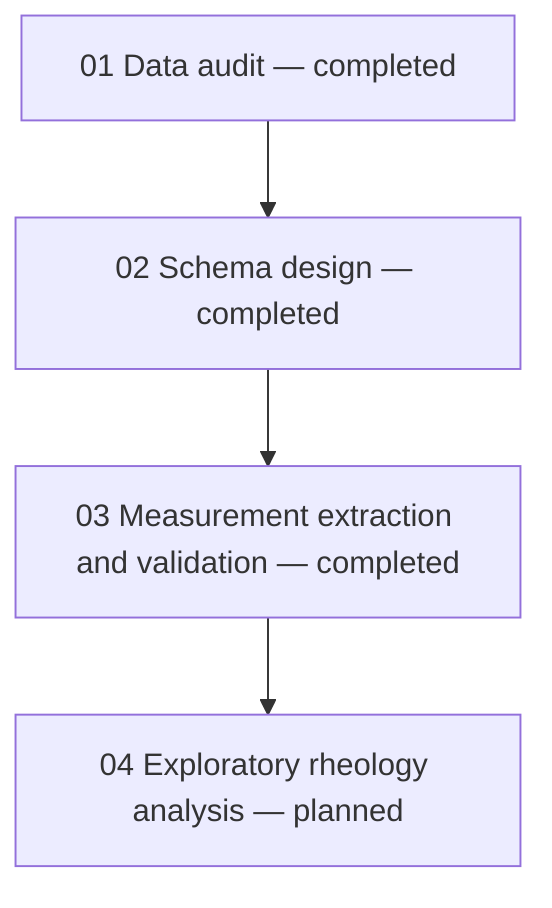

## Rendered project reports

- [01 — Data Audit Report](https://tehsongxuan.github.io/collagen-hydrogel-rheology-data-curation/01_data_audit_report.html)
- [02 — Schema Design Report](https://tehsongxuan.github.io/collagen-hydrogel-rheology-data-curation/02_schema_design.html)

# Collagen Hydrogel Rheology Data Curation and Analysis

[](https://doi.org/10.5281/zenodo.17413651)

> A reproducible Python workflow for source-data provenance, Excel-workbook auditing, rheology schema design, controlled measurement extraction, quality-control linkage and validation of bovine-collagen hydrogel rheology data.

## Project overview

Rheological measurements are often exported as instrument-generated spreadsheets rather than analysis-ready scientific datasets. Before such measurements can be compared or analysed reliably, workbook structure, variable names, unit labels, formulas, missing values and unusual observations need to be understood and handled transparently.

This project develops an auditable workflow for curating bovine-collagen hydrogel rheology workbooks while preserving the original experimental records and their provenance.

The workflow is organised into four stages:

1. **Source-data audit** — inspect workbook structure, provenance and quality-control issues.
2. **Schema design** — define explicit experiment- and measurement-level data models.
3. **Controlled measurement extraction and validation** — extract source measurements into a canonical schema, enforce documented rules and retain row-level traceability.
4. **Exploratory rheology analysis** — analyse the validated processed tables without introducing unsupported experimental assumptions.

Stages **01–03 are complete**. Exploratory analysis is the next stage.


```mermaid
flowchart TD
    A["01 Data audit — completed"] --> B["02 Schema design — completed"]
    B --> C["03 Measurement extraction and validation — completed"]
    C --> D["04 Exploratory rheology analysis — planned"]
```

## Rendered project reports

- [01 — Data Audit Report](https://tehsongxuan.github.io/collagen-hydrogel-rheology-data-curation/01_data_audit_report.html)
- [02 — Schema Design Report](https://tehsongxuan.github.io/collagen-hydrogel-rheology-data-curation/02_schema_design.html)
- [03 — Measurement Extraction and Validation Report](https://tehsongxuan.github.io/collagen-hydrogel-rheology-data-curation/03_measurement_extraction_validation.html)

## Project status

| Stage | Main artefact | Status | Purpose |
|---|---|---|---|
| 01 — Source-data audit | `notebooks/01_data_audit.ipynb` | **Completed** | Verify provenance, inventory source workbooks, identify structural and unit-label differences, investigate unusual observations and document processing decisions |
| 02 — Rheology schema design | `notebooks/02_schema_design.ipynb` | **Completed** | Define experiment and measurement structures, identifiers, field definitions, units, missing-value policies and provenance relationships |
| 03 — Measurement extraction and validation | `notebooks/03_measurement_extraction_validation.ipynb` | **Completed** | Extract all measurement rows into the canonical schema, validate row counts and identifiers, apply approved unit mappings, link applicable QC findings and verify local processed outputs |
| 04 — Exploratory rheology analysis | Downstream analysis notebook | **Planned** | Examine rheological behaviour, repeatability, concentration-dependent patterns and documented QC observations using the validated processed tables |

## What this repository demonstrates

The project emphasises materials-data curation and workflow engineering rather than treating the source spreadsheets as immediately analysis-ready.

Key practices demonstrated include:

- source-file provenance and integrity checks;
- read-only workbook auditing before transformation;
- explicit experiment- and measurement-level schemas;
- deterministic identifiers for experiment and measurement records;
- source-row traceability from processed observations back to Excel workbooks;
- separation of structural absence from unexpected missingness;
- controlled unit-label standardisation without altering numerical measurements;
- linkage of documented quality-control findings to processed measurements;
- restart-safe notebook execution from a fresh kernel;
- validation before local processed-data export; and
- repository safeguards that keep source and row-level processed measurements out of the public GitHub repository.

---

## Scientific context

The rheology workbooks accompany the research article:

*Quantitative atlas of collagen hydrogels reveals mesenchymal cancer cell traction adaptation to the matrix nanoarchitecture.*

The associated study combines rheology with other experimental techniques to investigate collagen hydrogel structure, mechanics and biological interactions.

This repository has a narrower purpose: it focuses specifically on developing a reproducible data-curation workflow for the accompanying rheology workbooks. It does not reproduce the microscopy or cell-traction analyses and does not claim ownership of the experimental data.

## Data source

The source data were obtained from the public Zenodo record:

- **Dataset:** *PID2020-113790RB-I00 data set: hydrogel viscoelastic properties from rheology tests*
- **Repository:** Zenodo
- **DOI:** [10.5281/zenodo.17413651](https://doi.org/10.5281/zenodo.17413651)
- **Related publication:** [10.1016/j.actbio.2024.07.002](https://doi.org/10.1016/j.actbio.2024.07.002)
- **Source archive:** `Reología.rar`
- **Material system:** bovine-collagen hydrogels
- **Reported collagen concentrations:** 0.8, 1.5 and 2.3 mg/mL
- **Reported measurement temperature:** 37 °C
- **Test types:** frequency sweep and time sweep

The downloaded archive is checked against the MD5 checksum published with the Zenodo record. A SHA-256 checksum is also recorded as an additional local integrity reference.

The raw archive and extracted Excel workbooks are treated as immutable source records.

At the time this repository documentation was prepared, the Zenodo record did not display a specific dataset licence in its `Rights` section. Public accessibility alone does not establish permission to redistribute source measurements. The repository therefore links to the authoritative Zenodo record rather than redistributing the raw archive, extracted workbooks or row-level processed copies.

## Source-data summary

The audited dataset contains **20 Excel workbooks and 660 measurement rows**.

| Test type | Workbooks | Rows per workbook | Total rows |
|---|---:|---:|---:|
| Frequency sweep | 10 | 21 | 210 |
| Time sweep | 10 | 45 | 450 |
| **Total** | **20** | — | **660** |

Filename components were parsed to recover collagen concentration, replicate label and source test type:

- `frecuencia` → `frequency_sweep`
- `tiempo` → `time_sweep`

Each audited workbook contains one worksheet named `Hoja1`.

---

# Stage 01 — Source-data audit

## `01_data_audit.ipynb`

Stage 01 performs a read-only audit before scientific standardisation or exploratory analysis.

### Audit coverage

The workflow:

- records dataset provenance, retrieval metadata and file checksums;
- inventories the extracted Excel workbooks;
- parses concentration, replicate and test-type metadata from filenames;
- records worksheet names, dimensions and populated ranges;
- identifies recurring heading and unit patterns;
- compares source workbooks against working expected structures;
- investigates unexpected columns and unusual numerical observations directly against the originals;
- examines non-standard unit labels at character level;
- validates explicit unit-label mappings; and
- exports machine-readable provenance and QC records.

### Audit outcome

| Audit measure | Result |
|---|---:|
| Workbooks audited | 20 |
| Workbooks matching the working header structure | 19 of 20 |
| Workbooks matching the working unit structure | 15 of 20 |
| Workbooks requiring detailed inspection | 5 |
| Confirmed QC findings | 8 |

### Confirmed findings and processing decisions

| Finding | Evidence | Processing decision |
|---|---|---|
| Unexpected column | `Colageno_bov_0.8_2_frecuencia.xlsx`, `Hoja1`, column `F`; `F6:F15` empty and `F16:F26` contain formulas following `=D[row]+1` | Preserve the source workbook; exclude undocumented column `F` from the standardised frequency-sweep dataset |
| Zero storage modulus | `Colageno_bov_0.8_1_frecuencia.xlsx`, `Hoja1`, cell `C6`; \(G' = 0\) Pa at 0.628 rad/s, with \(G'' = 1.590\) Pa at 37 °C | Retain the numeric zero and preserve the observation in QC traceability |
| Six non-standard unit labels | Temperature and complex-viscosity labels contain non-standard Unicode characters | Preserve source labels for provenance and apply only validated canonical labels during controlled processing |

### Validated unit-label mappings

| Variable | Observed source label | Canonical label |
|---|---|---|
| Temperature | `[ｰC]` | `[°C]` |
| Complex viscosity | `[Paｷs]` | `[Pa·s]` |

The original source labels remain unchanged in the source workbooks.

### Stage 01 outputs

```text
metadata/source_manifest.csv
metadata/extracted_file_inventory.csv
metadata/workbook_structure_inventory.csv
metadata/workbook_schema_qc.csv

data/quality_control/unit_label_mapping_audit.csv
data/quality_control/data_quality_issue_log.csv
```

These files preserve the connection between processing decisions and the original workbook, worksheet, cell or cell range.

---

# Stage 02 — Rheology schema design

## `02_schema_design.ipynb`

Stage 02 converts the workbook-audit findings into an explicit data model for subsequent processing.

The design separates:

| Record level | Meaning |
|---|---|
| Physical sample | One physical hydrogel replicate, where sample identity can be supported by evidence |
| Experiment | One rheological test represented by a source workbook and worksheet |
| Measurement | One source-reported measurement point within an experiment |
| QC finding | One documented issue or observation associated with a source location |

This separation prevents individual measurement points from being treated as independent hydrogel samples.

## Sample-linkage boundary

The 20 workbooks form 10 concentration–replicate label groups, each containing one frequency-sweep and one time-sweep workbook with matching concentration and replicate labels.

Those filename relationships are useful for provenance, but they do **not** independently prove that the two tests were performed on the same physical hydrogel specimen.

Therefore:

- frequency- and time-sweep workbooks remain separate experiment records;
- no shared physical-sample identifier is assigned solely from filenames;
- source replicate labels are retained;
- paired cross-test analyses are not assumed to be valid without additional evidence; and
- physical sample linkage remains unresolved.

## Experiment register

The exported register contains:

- **20 experiment records**;
- **20 unique experiment IDs**;
- **10 frequency-sweep experiments**;
- **10 time-sweep experiments**; and
- no duplicate experiment IDs.

Each identifier is constructed as:

```text
dataset_id::original_filename::sheet_name
```

This keeps every experiment directly traceable to its original dataset, workbook and worksheet.

## Measurement identity and provenance

Each processed measurement is traceable to:

1. its experiment; and
2. the original Excel row containing the observation.

The deterministic measurement identifier is:

```text
experiment_id::row_<source_excel_row>
```

Two coordinates are deliberately preserved:

- `source_excel_row` — physical Excel row number;
- `measurement_point` — source-reported `Meas. Pts.` value.

These are not interchangeable.

## Important time-sweep constraint

The time-sweep workbooks contain `Meas. Pts.` but do **not** provide a confirmed elapsed-time variable or sampling interval.

Therefore:

- `measurement_point` is retained as measurement order;
- it is not converted to seconds or minutes;
- elapsed time is not inferred; and
- time-dependent rates are not calculated from an assumed interval.

## Canonical measurement schema

Stage 02 defines **11 measurement fields**.

### Identity and provenance

```text
measurement_id
experiment_id
source_excel_row
measurement_point
```

### Rheological fields present in both test types

```text
angular_frequency_rad_s
storage_modulus_pa
loss_modulus_pa
temperature_c
```

### Additional time-sweep fields

```text
shear_stress_pa
strain_percent
complex_viscosity_pa_s
```

For frequency-sweep records, these three time-sweep-only fields are structurally absent and are represented as missing rather than filled with zero.

### Stage 02 outputs

```text
metadata/experiment_register.csv
metadata/experiment_data_dictionary.csv
metadata/measurement_data_dictionary.csv
```

---

# Stage 03 — Controlled measurement extraction and validation

## `03_measurement_extraction_validation.ipynb`

Stage 03 implements the measurement schema designed in Stage 02 and applies the decisions documented during the Stage 01 audit.

The notebook is designed to run reproducibly from a fresh kernel and performs source reconciliation, controlled extraction tests, full-dataset extraction, unit-label validation, row-level QC linkage, final structural validation, publication-safety checks and local processed-data verification.

## Controlled extraction tests

Before processing all workbooks, one registered workbook from each test type is extracted and validated.

### Frequency-sweep test

- 21 measurement rows extracted;
- source Excel rows 6–26 retained;
- the documented \(G' = 0\) observation remains unchanged;
- time-sweep-only fields remain structurally missing; and
- deterministic measurement IDs are generated.

### Time-sweep test

- 45 measurement rows extracted;
- source Excel rows 6–50 retained;
- all time-sweep-only fields are populated where expected; and
- no elapsed-time variable is invented from `Meas. Pts.`.

## Full-dataset extraction

The complete Stage 03 workflow successfully processes:

| Validation measure | Result |
|---|---:|
| Workbooks represented | 20 |
| Measurement rows | 660 |
| Schema fields | 11 |
| Registered experiments represented | 20 |
| Measurement-ID rule mismatches | 0 |
| Duplicate measurement IDs | 0 |
| Duplicate experiment/source-row pairs | 0 |
| Invalid source Excel rows | 0 |
| Invalid measurement points | 0 |
| Non-numeric populated rheology values | 0 |
| Workbook row-count mismatches | 0 |
| Retained \(G' = 0\) observations | 1 |

## Unit-label validation

Stage 03 verifies unit labels across the full source collection.

Canonical labels such as `[Pa]` and `[rad/s]` are retained directly. The six previously audited non-standard labels are recognised through the approved Stage 01 mapping records.

The validation:

- recognises all six approved mappings;
- leaves numerical measurements unchanged;
- leaves source workbooks unchanged; and
- reports no unresolved unit-label cases.

## Measurement-level QC linkage

The audit issue log contains eight confirmed Stage 01 findings.

Only one finding refers directly to an individual measurement row: `VALUE-001`, the documented zero storage modulus.

Stage 03 deterministically links this finding to its processed measurement using the source workbook, worksheet and Excel row, and confirms that the extracted value remains:

```text
G' = 0.0 Pa
```

The remaining QC findings are retained as source- or schema-level provenance records rather than being forced into measurement-level links.

## Final in-memory validation

Before any processed measurement file is written, the complete 660-row canonical table is checked for:

- exact Stage 02 schema conformity;
- experiment coverage;
- deterministic measurement-ID construction;
- duplicate identifiers;
- duplicate experiment/source-row pairs;
- source-row validity;
- measurement-point validity;
- numeric rheology fields;
- structural missingness;
- expected time-sweep fields;
- workbook-level row counts; and
- retention of the documented zero-\(G'\) observation.

All implemented checks pass.

## Local processed outputs

After validation, Stage 03 writes two local processed files:

```text
data/processed/frequency_sweep_standardised.csv
data/processed/time_sweep_standardised.csv
```

The files contain:

| Local file | Rows | Fields |
|---|---:|---:|
| Frequency sweep | 210 | 11 |
| Time sweep | 450 | 11 |
| **Total** | **660** | **11-field canonical schema** |

The files are immediately reloaded and revalidated for row counts, schema order, identifier uniqueness and expected structural missingness.

These row-level processed files are **not intended for public redistribution through this repository** and remain excluded by `.gitignore`.

---

# Reproducibility and restart safety

The notebooks are structured so that required imports, paths, control tables and dependencies are established explicitly.

The Stage 03 workflow has been organised to support:

```text
Kernel → Restart & Run All
```

without relying on hidden in-memory state from an earlier interactive session.

The project environment is documented in:

```text
environment.yml
```

The validated working environment used for the project includes Python 3.11, NumPy 1.26 and pandas 2.2.

---

# Repository publication safeguards

The repository-level `.gitignore` excludes:

```text
data/raw/**
data/interim/**
data/processed/**
```

Optional `.gitkeep` files may remain tracked so the directory structure can be represented without publishing protected source or processed measurement files.

This protects the normal Git workflow from accidental inclusion of:

- the original source archive;
- extracted third-party Excel workbooks; and
- row-level processed measurement tables.

The notebook checks these rules before performing its local processed-data export.

---

# Current repository structure

```text
collagen-hydrogel-rheology-data-curation/
│
├── README.md
├── environment.yml
├── .gitignore
│
├── notebooks/
│   ├── 01_data_audit.ipynb
│   ├── 02_schema_design.ipynb
│   └── 03_measurement_extraction_validation.ipynb
│
├── metadata/
│   ├── source_manifest.csv
│   ├── extracted_file_inventory.csv
│   ├── workbook_structure_inventory.csv
│   ├── workbook_schema_qc.csv
│   ├── experiment_register.csv
│   ├── experiment_data_dictionary.csv
│   └── measurement_data_dictionary.csv
│
├── data/
│   ├── raw/                # local / excluded from Git
│   ├── interim/            # local / excluded from Git
│   ├── processed/          # local / excluded from Git
│   └── quality_control/
│       ├── data_quality_issue_log.csv
│       └── unit_label_mapping_audit.csv
│
└── rendered reports / GitHub Pages HTML
```

---

# Scientific boundaries and limitations

The workflow deliberately preserves several unresolved or source-limited aspects of the dataset:

1. **Physical sample linkage remains unresolved.** Matching concentration and replicate labels across frequency- and time-sweep filenames do not independently establish that the tests used the same physical hydrogel specimen.

2. **`Meas. Pts.` is not an elapsed-time variable.** The time-sweep workbooks do not provide a confirmed time interval, so elapsed time is not inferred.

3. **No undocumented experimental metadata are created.** Sample identity, processing history, measurement conditions or relationships not supported by the source records are not added during curation.

4. **Stage 03 validates structure, provenance and documented QC behaviour.** It does not by itself establish the physical plausibility of every rheological observation.

5. **Row-level source and processed measurements are not redistributed here.** The authoritative source remains the Zenodo record.

---

# Next stage

The next planned notebook will perform exploratory rheology analysis using the validated local processed tables.

The analysis will be designed around the evidence available in the source data and will preserve the same provenance and uncertainty boundaries established during Stages 01–03.

Potential analysis themes include:

- inspection of \(G'\) and \(G''\) behaviour across frequency sweeps;
- comparison of rheological patterns across collagen concentrations;
- replicate-level visualisation;
- review of the relationship between elastic and viscous response; and
- explicit treatment of documented QC observations.

No cross-test physical pairing or elapsed-time interpretation will be assumed unless additional experimental evidence becomes available.

---

## Citation and data ownership

This repository contains an independently developed data-curation and validation workflow applied to a publicly available research dataset.

The experimental data remain attributable to their original creators and source repository. Users should consult the authoritative Zenodo record and related publication for dataset citation, provenance, reuse conditions and scientific context.

- Dataset DOI: [10.5281/zenodo.17413651](https://doi.org/10.5281/zenodo.17413651)
- Related publication DOI: [10.1016/j.actbio.2024.07.002](https://doi.org/10.1016/j.actbio.2024.07.002)

